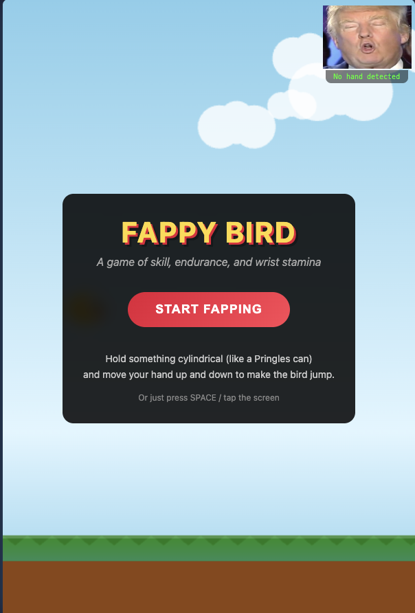

# Fappy Bird

A Flappy Bird clone with hand tracking. 

**[Play Now](https://strml.github.io/fappy-bird/)**



## How to Play

1. Hold something cylindrical (like a Pringles can)
2. Move your hand up and down to make the bird jump
3. Or just press SPACE / tap the screen

## Features

- Hand tracking via TensorFlow.js + MediaPipe
- Speed ramping: starts at 50%, increases 5% per pipe, maxes at 100%
- Secret win condition (you'll know it when you see it)

## Development

```bash
# Serve locally
python3 -m http.server 8000

# Run tests
node tests/run.js
```

## Credits

Another banger by [STRML](https://strml.net)
